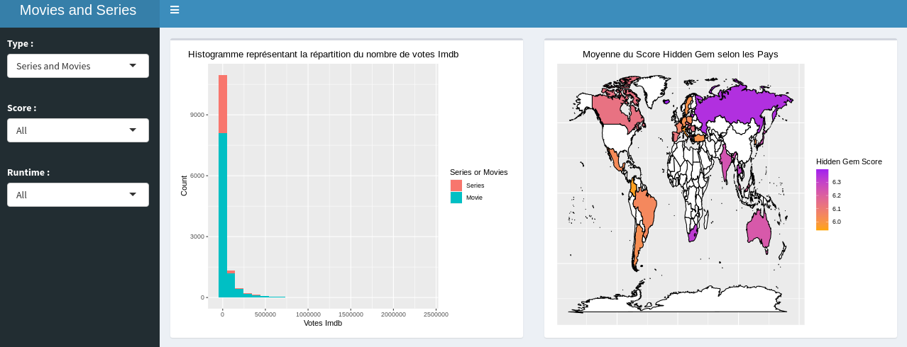
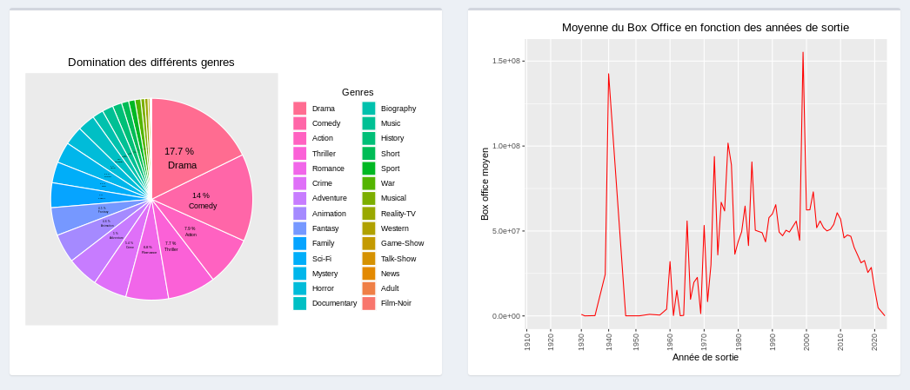

---
output:
  pdf_document: default
  html_document: default
---
<div id="top"></div>

[![LinkedIn][linkedin-shield]][linkedin-url]
[![Contributors][contributors-shield]][contributors-url]


<!-- PROJECT LOGO -->
<br />
<div align="center">

  <h3 align="center">Series and Movies R Dashboarding</h3>


</div>

<!-- TABLE OF CONTENTS -->
<details>
  <summary>Table of Contents</summary>
  <ol>
    <li>
      <a href="#about-the-project">About The Project</a>
      <ul>
        <li><a href="#built-with">Built With</a></li>
      </ul>
    </li>
    <li>
      <a href="#getting-started">Getting Started</a>
      <ul>
        <li><a href="#prerequisites">Prerequisites</a></li>
        <li><a href="#installation">Installation</a></li>
      </ul>
    </li>
    <li>
      <a href="#developer_guide">Developer_Guide</a></li>
      <ul>
        <li><a href="#data_cleaning">Data_Cleaning</a></li>
        <li><a href="#dashboard">Dashboard</a></li>
      </ul>
    <li><a href="#roadmap">Roadmap</a></li>
    <li><a href="#contributing">Contributing</a></li>
    <li><a href="#license">License</a></li>
    <li><a href="#contact">Contact</a></li>
    <li><a href="#acknowledgments">Acknowledgments</a></li>
  </ol>
</details>


<!-- ABOUT THE PROJECT -->
## About The Project

This is a project  of our second year of engineering study. It took place in september and october. Our goal is to create an interactive dashboard including a map and an histogram. 
The Dataset is present on kaggle : 
www.kaggle.com/ashishgup/netflix-rotten-tomatoes-metacritic-imdb.

This dataset combines data sources from Netflix, Rotten Tomatoes, IMBD, posters, box office informations, 
trailers on YouTube, and more using a variety of APIs. 
Note that there is no official Netflix API.

"Hidden Gem Score" is calculated using low review count and high rating. Lower the review count and higher the user rating, higher the hidden gem score.

Use the `README.md` to get started.

<p align="right">(<a href="#top">back to top</a>)</p>


<!-- GETTING STARTED -->
## Getting Started

To get the projet, you need to clone it with the following command 

* Clone git repository
  ```sh
  git clone https://github.com/juju312000/Series_R_Dashboarding.git
  ```

https://github.com/juju312000/Series_R_Dashboarding.git 

This repository is storage on github.
To get a local copy, run follow this simple step.

## User_Guide

You need to install packages and call them to run the project.
The simpler way is to run in RStudio the few lines in the packages.R file.

### Built With

This project writed in R. Here are the different library used in the project :

* [GGplot2](https://ggplot2.tidyverse.org/)
* [Tidyverse](https://www.tidyverse.org/)
* [Shiny](https://shiny.rstudio.com/)
* [ShinyDashboard](https://rstudio.github.io/shinydashboard/)
* [Gapminder](https://www.gapminder.org/)
* [Devtools](https://www.r-project.org/nosvn/pandoc/devtools.html)
* [Scales](https://scales.r-lib.org/)
* [Kaggler](https://medium.com/mcd-unison/how-to-use-kaggle-api-to-download-datasets-in-r-312179c7a99c)

<p align="right">(<a href="#top">back to top</a>)</p>


Once the packages are well installed and imported in your RStudio, just run the app by writing 'runApp('Projet')' and you will be able to see the dashboard.

<!-- Developer_Guide -->
## Developer_Guide

This project is divided in 2 parts :

* Data cleaning 
* Dashboard


### Data Cleaning 

In "global.R" file we first download the dataset.
```sh
download.file(response[["url"]], "netflix-rotten-tomatoes-metacritic-imdb.zip", mode="wb")

  ```
When it's done, we read the .csv and select columns we want.
We clean the first issues we have seen which are the most easy to fix. That's what we do in the global.R file after downloading and importing the datas.


In the original dataset in the column "country_availability", countries are present and split by comma.
In the function [clean_country](clean_country.R) we create as much columns as countries and we put [True]() or [False]() 
if the country is in or not.

We have so a dataframe with a lot of columns. We will pivot it with the function [pivot_longer](clean_country.R).
That returns a dataframe with number of original rows * number of country.

We delete rows which are False in pivot column since it's an information we won't use, and rename rename the 'country' column into 'region' in order to make a geographical plot.

We make the exact same with genre is the function [clean_genre](clean_genre.R).

We have now 3 different datasets. One which is specialised in the plots linked to the genre category, another specialised in the geographical plots and a classic one for all other types of plots.

However, our datas are not totally ready for the plots since there is few changements to do in the server in order to plot according to our filters.

## Dashboard

In R Dashboard, there are 2 main parts which are :

* UI
* Server

### UI 

This part is located in the ui.R file, where we just create several Inputs in the SidebarMenu. For this project, we chose the type, which is a movie, a serie or both as a variable. We took the imdb_score and the run time as well. 

Secondly, in the Dashboard Body, we just plot our the diffenrent graphs made in the server.R file 


### Server

Here comes the most difficult part. Located in the server.R file this is where we at first filter the datas according to our Inputs declared in the UI. Once this filtering is done, we now have to create reactive functions to produce our datas which goes into our different plot functions. 

We have once again a particular Dataset for the countries and another for the genres.

* We now have the df_map() Dataset which goes into [trace_map_plot](trace_map_plot.R);
* the df_pie() Dataset which goes into [trace_pie_chart](trace_pie_chart.R);
* and the df_filtr() for the other plots which are done in the [trace_histo](trace_histo.R) and the [trace_geom_plot](trace_geom_plot.R) functions.

#### Here is a visual of our R Dashboard




## Analysis Report


<!-- CONTACT -->
## Contact

MARCHADIER Julien - julien.marchadier@edu.esiee.fr
REBUFFEY Valentin - valentin.rebuffey@edu.esiee.fr  

Project Link: [https://github.com/juju312000/Series_R_Dashboarding](https://github.com/juju312000/Series_R_Dashboarding)

<p align="right">(<a href="#top">back to top</a>)</p>


<!-- MARKDOWN LINKS & IMAGES -->
<!-- https://www.markdownguide.org/basic-syntax/#reference-style-links -->
[contributors-shield]: https://img.shields.io/github/contributors/juju312000/Series_Py_Dashboarding.svg?style=for-the-badge
[contributors-url]: https://github.com/juju312000/Series_Py_Dashboarding/graphs/contributors
[forks-shield]: https://img.shields.io/github/forks/othneildrew/Best-README-Template.svg?style=for-the-badge
[forks-url]: https://github.com/othneildrew/Best-README-Template/network/members
[stars-shield]: https://img.shields.io/github/stars/othneildrew/Best-README-Template.svg?style=for-the-badge
[stars-url]: https://github.com/othneildrew/Best-README-Template/stargazers
[issues-shield]: https://img.shields.io/github/issues/othneildrew/Best-README-Template.svg?style=for-the-badge
[issues-url]: https://github.com/othneildrew/Best-README-Template/issues
[license-shield]: https://img.shields.io/github/license/othneildrew/Best-README-Template.svg?style=for-the-badge
[license-url]: https://github.com/othneildrew/Best-README-Template/blob/master/LICENSE.txt
[linkedin-shield]: https://img.shields.io/badge/-LinkedIn-black.svg?style=for-the-badge&logo=linkedin&colorB=555
[linkedin-url]: https://linkedin.com/in/jmarchadier
[exemple]: data/example.png
